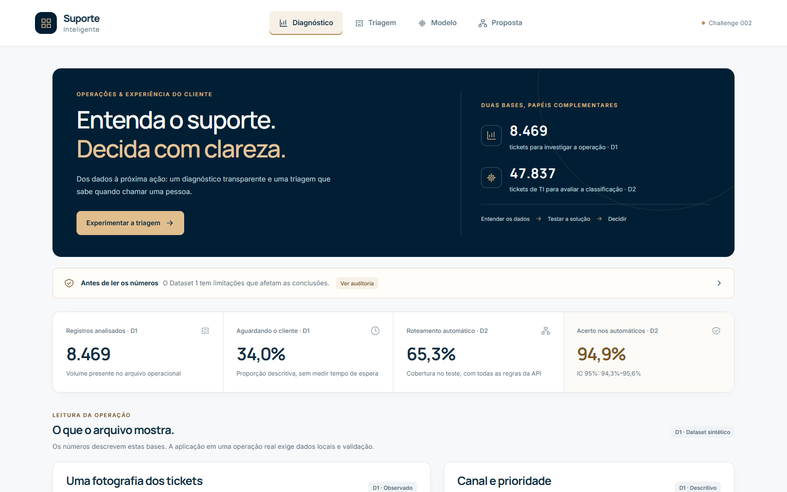
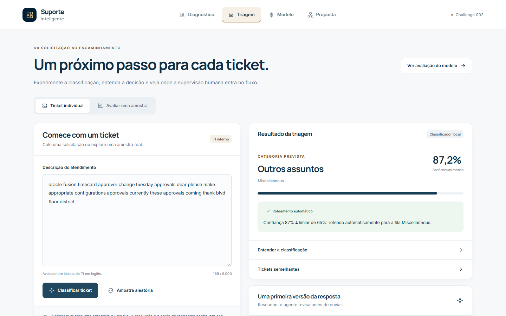
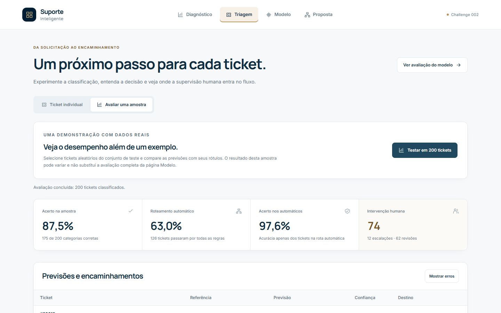
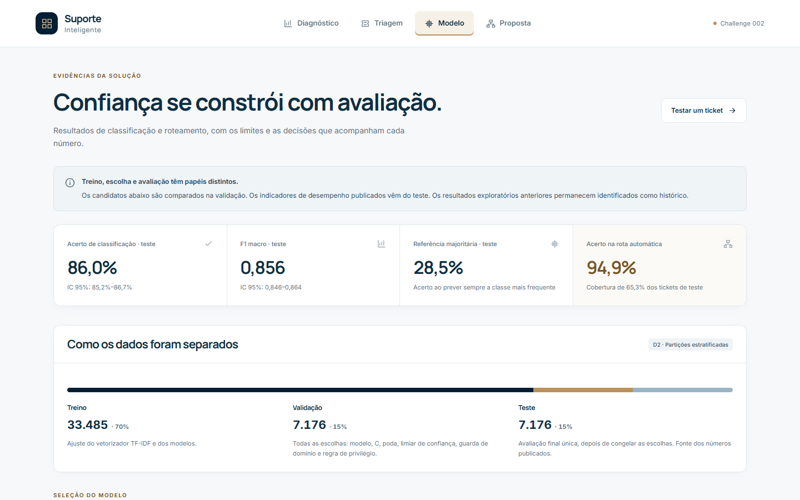
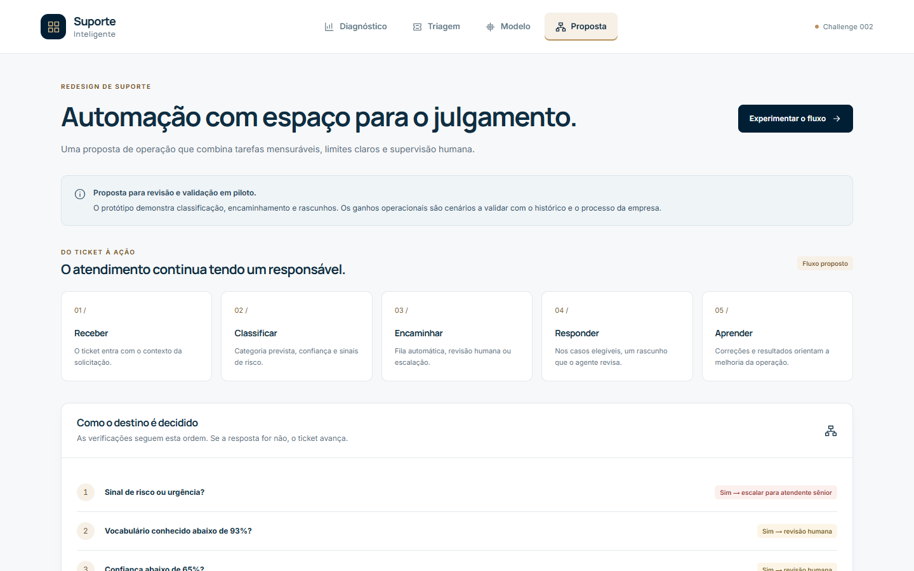
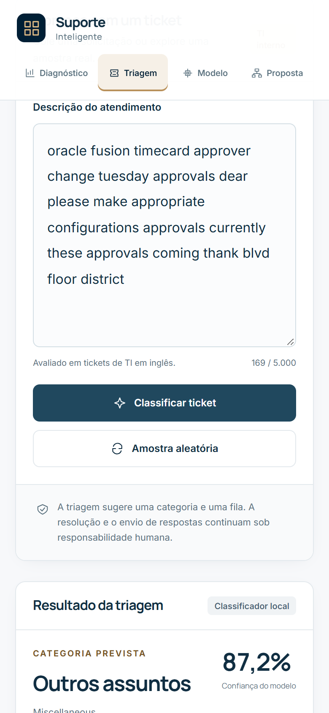

<!-- Gerado por solution/analysis/05_report.py a partir de docs/templates/README.md.tmpl. Não edite à mão. -->

# Submissão — Ricardo Barão — Challenge 002

## Sobre mim

- **Nome:** Ricardo Barão
- **LinkedIn:** _(preencher)_
- **Challenge escolhido:** 002 — Redesign de Suporte (Operações / CX)

---

## Executive Summary

Antes de gerar gráficos, auditamos os dados. O Dataset 1 (métricas operacionais) tem padrão de dado sintético: tempos inconsistentes, e não detectamos associação entre satisfação e as variáveis testadas. Por isso **não inventamos gargalos**: entregamos o que o arquivo sustenta e a metodologia pronta para rodar sobre os dados reais da operação. No Dataset 2 treinamos um classificador de tickets que, com uma política de roteamento que mantém pessoas nos casos de risco, **roteia automaticamente 65,3% dos tickets com 94,9% de acerto** (teste separado, IC 95% 94,3%–95,6%). O restante vai para revisão humana (28,1%) ou escalação (6,5%). No cenário estimado, isso libera **≈ 2.514 h/ano** (≈ 1,4 agente), e o maior ganho vem de triagem e follow-up, não da IA generativa. **Recomendação principal:** re-treinar com o histórico da operação e começar em modo sombra (a IA sugere, não aplica), porque medimos que, fora do domínio de treino, o modelo erra com convicção.

---

## Solução

| Entrega | Onde |
|---|---|
| **Protótipo rodando** (diagnóstico, triagem ao vivo, evidências do modelo, proposta) | **https://g4-challenge-002-ricardo-barao.vercel.app** · código em [`solution/app`](solution/app) |
| **Diagnóstico operacional** (onde trava, o que impacta satisfação, quanto desperdiçamos) | [`docs/diagnostico.md`](docs/diagnostico.md) |
| **Proposta de automação** (o que automatizar, o que **não**, fluxo e ROI) | [`docs/automacao.md`](docs/automacao.md) |
| **Classificador e roteamento** (protocolo de avaliação e resultados) | [`docs/modelo.md`](docs/modelo.md) |
| **Análise reprodutível** (Python) | [`solution/analysis`](solution/analysis) · [`solution/pipeline.sh`](solution/pipeline.sh) |

### Abordagem

1. **Entender antes de executar.** Li o desafio e os critérios: números concretos, uso dos dois datasets, proposta realista e protótipo com dados reais.
2. **Auditar os dados antes de concluir.** Hipóteses testadas, não assumidas:
   - Os campos são timestamps (não durações), todos numa janela de 27h, sem horário de abertura. Em 49,3% dos fechados (1.365 de 2.769) a resolução é anterior à 1ª resposta.
   - Kruskal-Wallis (tipo, prioridade, canal, gênero, produto) e Spearman (duração, idade) nos 2.769 tickets fechados: menor p = 0,25.
   - Placeholder literal {product_purchased} em 100,0% das descrições; resoluções são frases aleatórias. TF-IDF + regressão logística (validação cruzada de 5 folds, vetorizador ajustado dentro de cada fold) acerta o tipo em 18,7%, contra 20,7% chutando a classe mais comum.
3. **Diagnóstico com a força que os dados permitem.** A análise separa observado, limitação e cenário estimado. Os testes vêm com intervalo de confiança e com o tamanho de diferença que não seria detectável.
4. **Classificador com avaliação honesta** no Dataset 2 (47.837 tickets): partições de treino (33.485), validação (7.176) e teste (7.176). Tudo é escolhido na validação e congelado antes do teste.
5. **Política de roteamento explícita**, medida com as mesmas funções que a API executa. O humano fica nos casos de risco, baixa confiança, texto fora do padrão e pedidos de privilégio.
6. **Cruzamento dos datasets.** O modelo aplicado aos tickets do Dataset 1 mostrou que confiança alta não protege contra outro domínio, e isso virou um guarda na política.
7. **Revisão cruzada entre agentes.** O Codex revisou o backend em modo leitura, eu verifiquei cada apontamento e corrigi o que procedia. Os detalhes estão no process log.

### Resultados / Findings

**Diagnóstico (Dataset 1, 8.469 tickets)**
- Não detectamos associação entre status e canal (p = 0,77). Não detectamos associação entre status e prioridade (p = 0,23). Não detectamos associação entre status e tipo (p = 0,34).
- Satisfação: não detectamos associação nos testes realizados (tabela com diferenças detectáveis em `docs/diagnostico.md`).
- Descritivo: 67,3% dos registros não estão fechados e 34,0% aguardam o cliente. É uma contagem, não evidência de gargalo.

**Classificador e roteamento (teste, 7.176 tickets)**

| Métrica | Resultado (IC 95%) |
|---|---|
| Acurácia do classificador | 86,0% (85,2%–86,7%), contra 28,5% da classe mais comum |
| F1 macro | 0,856 (0,846–0,864) |
| Roteamento automático | 65,3% (64,2%–66,4%) |
| Acerto nos automáticos | 94,9% (94,3%–95,6%) |
| Revisão humana / escalação | 28,1% / 6,5% |
| Pedidos de privilégio que foram automaticamente para outra fila | 5 de 264 (1,9%) |
| Tickets de outro domínio barrados pelo guarda | 98,6% (contra 3,9% do próprio domínio) |

**Cenário de desperdício (30.000 tickets/ano, premissas editáveis):** ≈ 6.986 h/ano nas etapas analisadas, das quais **≈ 2.514 h/ano são recuperáveis**: triagem 816 h, follow-up 816 h, retrabalho 486 h e rascunhos 396 h. Mesmo no cenário mais pessimista da análise de sensibilidade, o ganho fica em 1.652 h/ano.

**Protótipo** (capturado do deploy público com o Edge em modo headless; sem erros de console nem rolagem horizontal em 1440 px e 390 px):

| Diagnóstico | Triagem de um ticket |
|---|---|
|  |  |
| **Avaliação ao vivo em 200 tickets do teste** | **Evidências do modelo** |
|  |  |
| **Proposta de automação** | **Triagem no celular** |
|  |  |

### Recomendações

1. **Registrar abertura, primeira resposta, resolução e reatribuições por ticket** e rodar `02_diagnostico.py` sobre esses dados. Sem isso, nenhum diagnóstico de gargalo é confiável.
2. **Re-treinar o classificador com o histórico rotulado da operação** e operar **4 semanas em modo sombra**, medindo cobertura, acerto e vazamento de privilégio no domínio real.
3. **Ligar primeiro o que é barato e mensurável:** roteamento automático nas categorias que baterem a meta e follow-up automático de pendências.
4. **Rascunho de resposta com IA generativa depois**, em teste A/B, sempre com revisão humana. Nunca em escalações, e isso já é bloqueado no servidor.
5. **Não automatizar:** casos com sinal de risco, pedidos de privilégio, reembolso e cancelamento, baixa confiança e texto fora do padrão.

### Limitações

- O Dataset 1 tem padrão de dado sintético (distribuições uniformes, placeholders no texto, resoluções aleatórias).
- Tempos de resposta/resolução não são utilizáveis (49% das resoluções antes da 1ª resposta; sem data de abertura). Não medimos gargalo de tempo por canal ou prioridade.
- Não detectar associação não prova ausência de efeito: diferenças pequenas podem não ser detectáveis com este volume.
- O roteamento foi medido em tickets de TI interna (Dataset 2). Aplicado aos tickets do Dataset 1 ele quase não roteia automaticamente (o guarda de domínio barra o texto). Em produção, re-treinar com o histórico da operação.
- Minutos por tarefa, taxa de roteamento errado, custo/hora e automação de follow-up são premissas a validar, não medições.
- O acerto nos automáticos (94,9%) ficou no limite inferior da meta de 95% usada na validação. Por isso a recomendação de modo sombra.
- Decisões de desenho do modelo foram tomadas antes de separarmos validação e teste. O teste final não é "virgem" em sentido estrito (detalhes em `docs/modelo.md`).
- O rascunho com LLM está implementado, mas não foi avaliado com chave real: o protótipo funciona sem ele.

### Como rodar

**Protótipo** (Node 24):
```bash
cd solution/app
npm install
npm run dev          # http://localhost:3000
npm test             # paridade TS × Python, política, APIs e calculadora (não precisa do Kaggle)
```
Opcional: o rascunho de resposta com LLM só liga com opt-in explícito. Em `solution/app/.env.local`, defina `DRAFTS_ENABLED=true` e `AI_GATEWAY_API_KEY`. Sem isso (como no link público), todo o resto funciona e a tela informa que o rascunho está desativado.

**Análise completa** (Python 3.12 via [uv](https://docs.astral.sh/uv/)):
1. Baixe os CSVs do Kaggle ([Dataset 1](https://www.kaggle.com/datasets/suraj520/customer-support-ticket-dataset), [Dataset 2](https://www.kaggle.com/datasets/adisongoh/it-service-ticket-classification-dataset)) para uma pasta e aponte `DATA_DIR` para ela.
2. `bash solution/pipeline.sh`, que roda auditoria → classificador → avaliação do roteamento → diagnóstico → documentos → testes. O resultado é determinístico (semente fixa).

---

## Process Log — Como usei IA

### Ferramentas usadas

| Ferramenta | Para que usou |
|---|---|
| **Claude Code** (Claude Opus 5) | Leitura do desafio e planejamento; auditoria e diagnóstico em Python; classificador, política de roteamento e API; testes; documentação gerada a partir dos dados |
| **Codex** (modelo gpt-6-astra, raciocínio xhigh) | Auditor de qualidade do backend (revisão cruzada em modo leitura); construção da interface (Next.js) em paralelo, coordenada por `AGENTS.md` e `HANDOFF.md` |

### Workflow

1. Pedi ao Claude Code que lesse o repositório e os 4 desafios. Escolhi o 002 e as decisões de arquitetura (Next.js na Vercel, classificador local + LLM só onde agrega) **antes** de qualquer código.
2. Auditoria dos dados como primeira etapa. A hipótese de dado sintético foi testada e confirmada, e mudou o desenho do diagnóstico.
3. Criamos um guia comum (`AGENTS.md`) com fatos verificados, divisão de responsabilidades por pasta e contratos de dados (`lib/types.ts`), para dois agentes trabalharem em paralelo na mesma branch.
4. Classificador, política e API, sempre com testes de paridade entre Python e TypeScript.
5. **Revisão cruzada:** pedi ao Codex para revisar o backend antes de ampliar funcionalidades. Ele apontou 6 problemas. Cada um foi verificado e corrigido, e os números publicados mudaram (tabela "antes × depois" no process log).
6. Interface construída pelo Codex sobre os contratos, enquanto o backend era corrigido.

Registro completo, com cada iteração: [`process-log/PROCESS_LOG.md`](process-log/PROCESS_LOG.md) · transcript: [`process-log/chat-exports/`](process-log/chat-exports/).

### Onde a IA errou e como corrigi

- **Avaliação contaminada:** os primeiros números (acurácia 86,4%, 69,7% automáticos com 95,7%) foram medidos no mesmo conjunto usado para escolher parâmetros. A revisão do Codex pegou isso; refizemos com treino, validação e teste.
- **Métrica incompleta:** a cobertura automática ignorava parte das regras que o app aplica. Passou a ser medida com as funções reais da API, e a medição revelou vazamento de pedidos de privilégio, que ganhou uma regra própria.
- **Premissa desmentida pelos dados:** a IA previu que o modelo teria "pouca confiança" em tickets de outro domínio. Medido, foi o oposto: 91% dos confiantes viraram "Hardware". Daí nasceu o guarda de domínio.
- **Paridade quebrada:** a inferência em TypeScript divergia da do Python porque textos longos foram exportados cortados. O teste de paridade pegou.
- **Afirmações não medidas:** "o texto não tem stopwords" (falso: medimos) e "fila sem reconhecimento ao cliente" (interpretação, não dado). Ambas foram corrigidas.
- **Segurança:** o rascunho confiava na categoria enviada pelo navegador. Hoje o servidor reclassifica e bloqueia antes de chamar o LLM.

### O que eu adicionei que a IA sozinha não faria

- Escolhi o desafio 002, e não o 003 recomendado pela IA, por ser o que combina diagnóstico, processo e construção.
- Decidi trabalhar com **dois agentes em paralelo** e, principalmente, pedir uma **revisão cruzada** antes de ampliar funcionalidades. Foi o que corrigiu os números publicados.
- Defini a direção visual da interface (referência G4 OS) e a ordem de entrega (triagem funcional primeiro).
- Mantive as decisões externas sob meu controle: conta do GitHub, deploy e uso de chave de LLM.

---

## Evidências

- [x] Screenshots do protótipo publicado: [`docs/screenshots/`](docs/screenshots/)
- [ ] Screen recording do workflow
- [x] Chat exports: [`process-log/chat-exports/`](process-log/chat-exports/) (transcript do Claude Code)
- [x] Git history: commits `[claude]` e `[codex]` mostram a evolução e a divisão de trabalho
- [x] Outro: [`process-log/PROCESS_LOG.md`](process-log/PROCESS_LOG.md), com registro cronológico, erros e correções

---

_Submissão enviada em: (preencher)_
